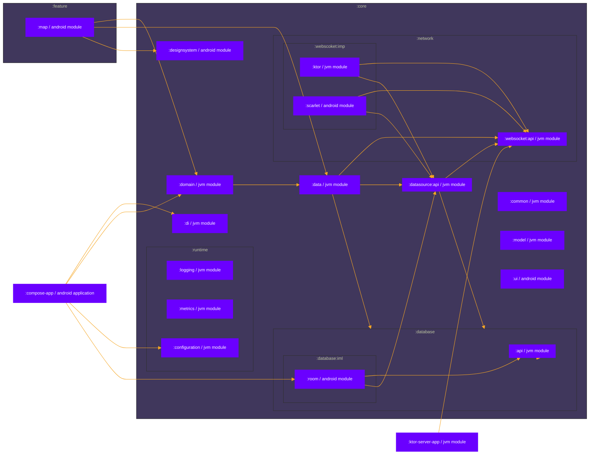

# PoC of design implementation for processing large GPS node trace data effectively

> [!WARNING]
> This branch in development. Project setup guide will be later. This has XCode projects, CocoaPods tool, different AndroidStudio plugins and run configuration that should be guided with instructions.

[](https://github.com/vitaliystoyanov/trace-node-tracking-playground/actions/workflows/main.yml)
 

> [!WARNING]
> This branch in development. Project setup guide will be later. This has XCode projects, CocoaPods tool, different AndroidStudio plugins and run configurations that should be guided with instructions.

The application processes GPS node trace data using the Scarlet websocket client, deserializes it using Gson and writes the data to a local Room database for further data rendering based on Jetpack Compose and MapBox SDK built-in capabilities.
On the other side, the Node.js backend generates sample data using the turf.js library. For each node, the route, direction and speed are generated at runtime.

Some considerations:
* The application processes 10 thousand websocket messages and then renders efficiently. The websocket message format is a string, but it is better to implement a binary message format. These nodes are dynamic moving, which is CPU and GPU-intensive to render and process highly frequently updated node movements. (However, there is a slight stuttering in UI rendering frames due to MapBox rendering on the native C++ side). All buffers have been disabled in the MapBox configuration.
* At each layer of the architecture: db entity, external and network models have mappers for each other. Used object pool design pattern to avoid intensive allocation/deallocation of objects.


<p align="center">
  
&nbsp; &nbsp; &nbsp; &nbsp;
  
</p>

## Tech stack

Nothing special :)

* Kotlin Channels & Flows APIs
* (experimental) Kotlin multiplatform / multi-format reflectionless serialization 
  * [Kotlin Serialization ProtoBuf](https://github.com/Kotlin/kotlinx.serialization/blob/master/docs/formats.md#protobuf-experimental)
* Jetpack Compose with Material3 design
* [Ktor.io Websocket Client](https://ktor.io/docs/websocket.html)
* [MapBox SDK for Android](https://docs.mapbox.com/android/maps/guides/)
* [Mapbox Maps Compose Extension](https://github.com/mapbox/mapbox-maps-android/tree/extension-compose-v0.1.0/extension-compose)
* [Scarlet: A Retrofit inspired WebSocket client](https://github.com/Tinder/Scarlet)
  * [Scarlet coroutines stream adapter](https://github.com/Tinder/Scarlet/tree/main/scarlet-stream-adapter-coroutines)
* [Room database](https://developer.android.com/training/data-storage/room)
* [OkHttp](http://square.github.io/okhttp/)
* [Koin: Kotlin & Kotlin Multiplatform DI framework](https://insert-koin.io/)

## Functionality
* Supports websocket connections in background
* Stores trace nodes to in-memory Room database
* Reactive rendering GeoJSON features from in-memory GeoJSON source. A GeoJSON source is a collection of one or more geographic features, which may be points, lines and so on.
* Data-driven map layer styling. Mapbox’s data-driven styling features allow to use attributes in the data to style maps. The app can style map features automatically based on their individual attributes.
* Allocates memory for processing node traces at runtime using Pool Object manager

## Design architecture


* The single source of truth principle: its database layer*
* Kotlin Coroutines and channels, flows as communication between arch layers: **websocket/database data sources** <-> **repository layer** <-> **data layer** <-> **reactive UI layer**
* The data and business layer expose suspend functions and Flows
* A model per layer: ViewModels include data layer models, repositories map DAO models to simpler data classes, a remote data source maps the model that it receives through the network to a simpler class
* ViewModels at screen level
* A single-activity application
* Follows Unidirectional Data Flow (UDF) principles
* The data layer exposes application data using a repository
* TBR

## Gradle module dependencies

* Android modules are configured Gradle modules with applied `com.android.library` plugin
* JVM modules are configured Gradle modules with applied `org.jetbrains.kotlin.jvm` plugin


## Streaming node traces with Ktor

### How to run local server

If your dev environment is emulator:
1. Change your local IPv4 address under res/xml/network_security.xml. For example, 192.168.0.101:
  ```xml
<?xml version="1.0" encoding="utf-8"?>
<network-security-config>
    <domain-config cleartextTrafficPermitted="true">
        <domain includeSubdomains="true">YOUR_IP_ADDRESS</domain>
    </domain-config>
</network-security-config>
```
2. Change `BASE_WS_HOST=YOUR_IP_ADDRESS` network configuration in https://github.com/vitaliystoyanov/trace-node-tracking-playground/blob/eb427caf772dd6dff62a5f223fb1511d1701f1f9/core/network/websocket/api/src/main/java/io/architecture/network/websocket/api/Configuration.kt#L14
3. Run 'Netty server' IDE configuration
```
2024-02-21 17:00:53.181 [main] INFO  ktor.application - Autoreload is disabled because the development mode is off.
2024-02-21 17:00:53.338 [main] DEBUG i.a.playground.modules.logger - Test binary message for NetworkClientTime:  08d6a3bce1dc31
2024-02-21 17:00:53.339 [main] INFO  ktor.application - Application started in 0.176 seconds.
2024-02-21 17:00:53.339 [main] INFO  ktor.application - Application started: io.ktor.server.application.Application@ceb4bd2
2024-02-21 17:00:53.405 [DefaultDispatcher-worker-1] INFO  ktor.application - Responding at http://0.0.0.0:8080
```

## Goals

To be a part of ... you know :)

